## Homework 01: due 2024/03/25 23:59

### - Tutorial: https://www.kaggle.com/prashant111/svm-classifier-tutorial

### - Please answer the following questions and work directly on this jupyter notebook.

### - Make sure the code can be run and show the result and figures properly.

### - Please write down your observation with markdown in this notebook briefly.


```python
# Import necessary modules
%matplotlib inline
import numpy as np
import matplotlib.pyplot as plt
import pandas as pd
import seaborn as sns
from scipy import stats
from sklearn.datasets import make_blobs, make_circles, load_breast_cancer
from sklearn.model_selection import train_test_split, GridSearchCV
from sklearn.svm import SVC
from sklearn.preprocessing import MinMaxScaler
from sklearn.metrics import RocCurveDisplay, ConfusionMatrixDisplay, accuracy_score, f1_score, precision_score, recall_score
seed = 20240325
```


```python
# Plotting function (you can modify this block to change the figure)
def plot_svc_decision_function(model, ax=None, mode='train'):
    xlim = ax.get_xlim()
    ylim = ax.get_ylim()
    
    # create grid to evaluate model
    x = np.linspace(xlim[0], xlim[1], 30)
    y = np.linspace(ylim[0], ylim[1], 30)
    X, Y = np.meshgrid(x, y)
    xy = np.vstack([X.ravel(), Y.ravel()]).T
    P = model.decision_function(xy).reshape(X.shape)
    
    if mode == 'train':
        ax.contour(X, Y, P, colors='k',
                   levels=[-1, 0, 1], alpha=0.5,
                   linestyles=['--', '-', '--'])
    else:
        ax.contour(X, Y, P, colors='k',
                   levels=[0], alpha=0.5,
                   linestyles=['-'])
    ax.set_xlim(xlim)
    ax.set_ylim(ylim)
```

### 1. Kernel function and hyper paramters of support vector machine. (30%)
#### Please make the scatter plots with data, and visualize the decision boundary and positive and negative hyperplanes on the following questions.

##### Here is the figure example:


##### 1-1. Please use the __**svc**__ function in scikit learn module to compare the impact of the kernel function on the given two data below. Try at least ***linear, poly & rbf*** kernel functions and set hyper parameters ***C, degree*** and ***gamma*** as default. (15%)


```python
# Do not change the data
X, y = make_blobs(n_samples=200, centers=2,random_state=seed, cluster_std=2)
```

##### Answer: 
- Linear : It can solve the linear problem in current dimensions. However it just can separation the linear problem. 
- Poly : It can project the data to high dimension features space that can solve some problem with not linear separation data. 
- RBF : It also can project data, but it will project to infinite dimensions feature space. RBF is flexibility and ability to capture complex relationships in the data.


```python
model_linear = SVC(kernel='linear')
model_poly = SVC(kernel='poly')
model_rbf = SVC(kernel='rbf')
model = [model_linear, model_poly, model_rbf]
fig, ax = plt.subplots(1, 3, figsize=(15, 4.5))

for i in range(len(model)):
    model[i].fit(X, y)
    ax[i].set_title('SVM (Kernel: ' + model[i].kernel + ')')
    ax[i].scatter(X[:, 0], X[:, 1], c=y)
    plot_svc_decision_function(model[i], ax[i])
plt.show()
```


    
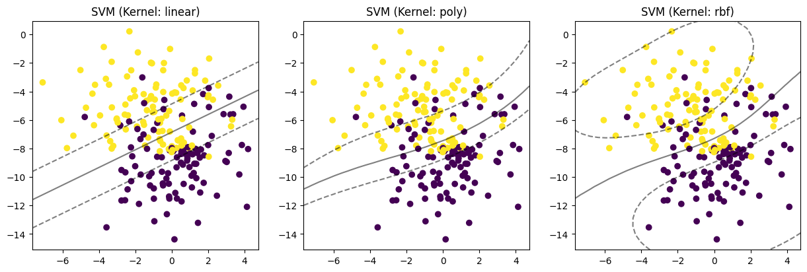
    


```python
# Do not change the data
X, y = make_circles(n_samples=200, noise=0.2, factor=0.5, random_state=seed)
```


```python
model_linear = SVC(kernel='linear')
model_poly = SVC(kernel='poly')
model_rbf = SVC(kernel='rbf')
model = [model_linear, model_poly, model_rbf]
fig, ax = plt.subplots(1, 3, figsize=(15, 4.5))

for i in range(len(model)):
    model[i].fit(X, y)
    ax[i].set_title('SVM (Kernel: ' + model[i].kernel + ')')
    ax[i].scatter(X[:, 0], X[:, 1], c=y)
    plot_svc_decision_function(model[i], ax[i])
plt.show()
```


    
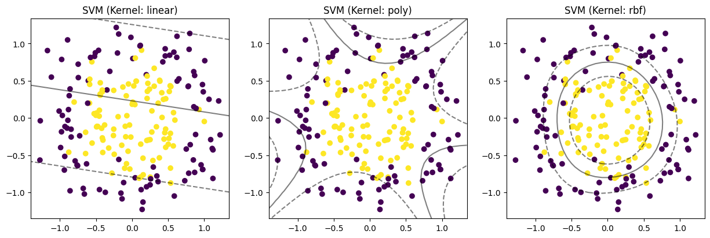
    


##### 1-2. Please use the __**svc**__ with ***linear*** kernel in scikit-learn module, and compare the impact of the hyper parameter ***C*** on the given data below. Try ***C=0.1 & 10000*** at least, and you can try more values of ***C*** to prove your observation. (5%)


```python
# Do not change the data
X, y = make_blobs(n_samples=200, centers=2,random_state=seed, cluster_std=0.5)
```

##### Answer:
- Small C : the decision boundary will be simplified to separate data, and that can avoid overfitting and generalize the testing data.
- Large C : the model can reduce more loss or error. Nevertheless, it would let the decision boundary be more complex, and have more prone to overfitting.


```python
c = np.array([0.1, 1, 10, 100, 1000, 10000])
model = list()
for i in c:
    model.append(SVC(kernel='linear', C=i))

fig, ax = plt.subplots(1, len(c), figsize=(5*len(c), 4.5))

for i in range(len(model)):
    model[i].fit(X, y)
    ax[i].set_title('SVM (C: ' + str(model[i].C) + ')')
    ax[i].scatter(X[:, 0], X[:, 1], c=y)
    plot_svc_decision_function(model[i], ax[i])
plt.show()
```


    
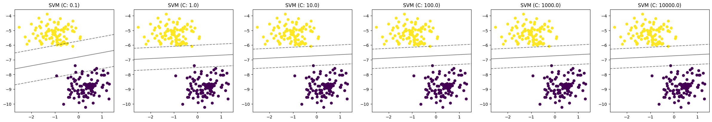
    


##### 1-3. Please use the __**svc**__ with ***poly*** kernel in scikit-learn module, and compare the impact of the hyper parameter ***degree*** on the given data below. Try ***degree=3 & 20*** at least, and you can try more values of ***degree*** to prove your observation. (5%)


```python
# Do not change the data
X, y = make_blobs(n_samples=200, centers=2,random_state=seed)
```

##### Answer:
The degree is the parameter to control the mapping data to high dimensional feature space.
- Low degree: the model may underfit the data moreover the decision boundary cannot separate the data. The model may not be able to find the relationship present in the data.
- High degree: the model  can explain the more complex and nonlinear data. The decision boundary can more fitting candidates flexible the data.


```python
degree = np.arange(3, 20, 4)
degree = np.append(degree, 20)
model = list()
for i in degree:
    model.append(SVC(kernel='poly', degree=i))

fig, ax = plt.subplots(1, len(degree), figsize=(5*len(degree), 4.5))

for i in range(len(model)):
    model[i].fit(X, y)
    ax[i].set_title('SVM (degree: ' + str(model[i].degree) + ')')
    ax[i].scatter(X[:, 0], X[:, 1], c=y)
    plot_svc_decision_function(model[i], ax[i])
plt.show()
```


    
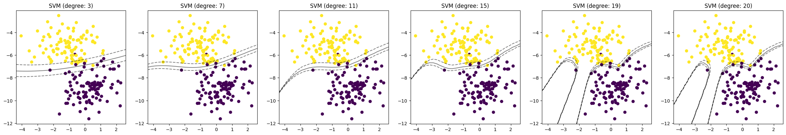
    


##### 1-4. Please use the __**svc**__ with ***rbf*** kernel in scikit-learn module, and compare the impact of the hyper parameter ***gamma*** on the given data below. Try ***gamma=1 & 15*** at least, and you can try more values of ***gamma*** to prove your observation. (5%)


```python
# Do not change the data
X, y = make_circles(n_samples=200, noise=0.3, factor=0.3, random_state=seed)
```

##### Answer:
- Small gamma : the decision boundary tends to be smoother, and avoids overfitting especially when dealing with noisy data.
- Large gamma : the decision boundary becomes more complex and can better fit the training data, potentially leading to overfitting.


```python
gamma = np.arange(1, 15, 3)
gamma = np.append(gamma, 15)
model = list()
for i in gamma:
    model.append(SVC(kernel='rbf', gamma=i))

fig, ax = plt.subplots(1, len(gamma), figsize=(5*len(gamma), 4.5))

for i in range(len(model)):
    model[i].fit(X, y)
    ax[i].set_title('SVM (gamma: ' + str(model[i].gamma) + ')')
    ax[i].scatter(X[:, 0], X[:, 1], c=y)
    plot_svc_decision_function(model[i], ax[i])
plt.show()
```


    
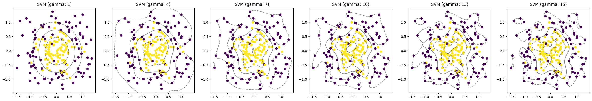
    


### 2. Model evaluation and hyper parameters searching. (30%)
#### Please make the scatter plots of data, visualize the hyperplane, support vector and margin and calculate the accuracy score on training data and testing data on the following questions.

##### Here is the figure example:


##### 2-1 Use the ***training ratio 0.8 and 0.2*** to split the given data, and use the ***rbf*** kernel with ***gamma = "auto"***. Please discuss the impact of training ratio. (Split the data with random state 0) (10%)


```python
# Do not change the data
X, y = make_blobs(n_samples=200, centers=2,random_state=seed, cluster_std=1.3)
```

##### Answer:
Training Data Size:
- Increasing the proportion of data allocated to the training set provides more samples for the model to learn from.
- A larger training set can potentially improve the model's ability to generalize to unseen data.
- However, if the training set becomes too large relative to the testing set, there might be insufficient data left for evaluation, leading to unreliable performance estimates.

Testing Data Size:
- Increasing the proportion of data allocated to the testing set provides more samples for evaluation.
- A larger testing set can provide a more reliable estimate of the model's performance on unseen data.
- However, if the testing set becomes too large relative to the training set, the model may not be trained adequately, leading to overfitting to the training data.


```python
train_size = np.arange(0.8, 0.2, -0.2)
X_train, X_test, y_train, y_test = list(), list(), list(), list()
for i in train_size:
    data = train_test_split(X, y, train_size=i, random_state=0)
    X_train.append(data[0])
    X_test.append(data[1])
    y_train.append(data[2])
    y_test.append(data[3])

model = list()
for i in range(len(X_train)):
    model.append(SVC(kernel='rbf', gamma="auto"))
    
fig, ax = plt.subplots(2, len(X_train), figsize=(5*len(X_train), 9))

for i in range(len(model)):
    model[i].fit(X_train[i], y_train[i])
    train_score = model[i].score(X_train[i], y_train[i])
    test_score = model[i].score(X_test[i], y_test[i])
    
    ax[0, i].set_title("SVM training (train_size: %.2f)" % train_size[i])
    ax[0, i].scatter(X_train[i][:, 0], X_train[i][:, 1], c=y_train[i])
    ax[0, i].legend([], title="train acc: %.2f" % train_score, loc='upper right')
    plot_svc_decision_function(model[i], ax[0, i])
    
    ax[1, i].set_title("SVM testing (train_size: %.2f)" % train_size[i])
    ax[1, i].scatter(X_test[i][:, 0], X_test[i][:, 1], c=y_test[i])
    ax[1, i].legend([], title="test acc: %.2f" % test_score, loc='upper right')
    plot_svc_decision_function(model[i], ax[1, i], mode='test')
plt.show()
```


    
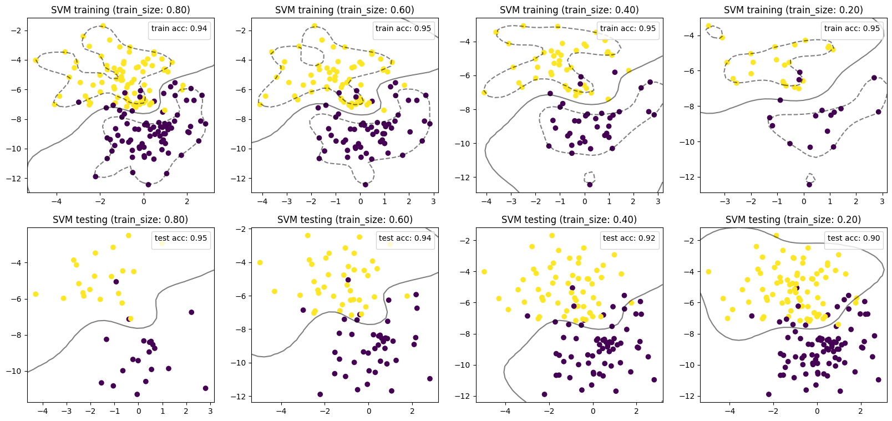
    


##### 2-2 Split the given data with ***training ratio 0.8***, and use the ***rbf*** kernel with different values of ***gamma = 1 and 10***. Please discuss the impact of gamma. (Split the data with random state 0) (10%)


```python
# Do not change the data
X, y = make_blobs(n_samples=200, centers=2,random_state=seed, cluster_std=1.5)
```

##### Answer

Gamma = 1:
- With gamma set to 1, the influence of each training example extends moderately.
- The decision boundary tends to be relatively smooth, resulting in a simpler model compared to higher gamma values.
- This setting is less prone to overfitting and may generalize well to unseen data.

Gamma = 10:
- With gamma set to 10, the influence of each training example is more localized.
- The decision boundary becomes more complex and flexible, fitting the training data more closely.
- This setting may lead to overfitting, especially if the dataset is small, as the model can capture intricate details and noise in the training data.


```python
X_train, X_test, y_train, y_test = train_test_split(X, y, train_size=0.8, random_state=0)
gamma = np.arange(1, 11, 3)

model = list()
for i in gamma:
    model.append(SVC(kernel='rbf', gamma=i))
    
fig, ax = plt.subplots(2, len(gamma), figsize=(5*len(gamma), 9))

for i in range(len(model)):
    model[i].fit(X_train, y_train)
    train_score = model[i].score(X_train, y_train)
    test_score = model[i].score(X_test, y_test)
    
    ax[0, i].set_title("SVM training (gamma: %.2f)" % gamma[i])
    ax[0, i].scatter(X_train[:, 0], X_train[:, 1], c=y_train)
    ax[0, i].legend([], title="train acc: %.2f" % train_score, loc='upper right')
    plot_svc_decision_function(model[i], ax[0, i])
    
    ax[1, i].set_title("SVM testing (gamma: %.2f)" % gamma[i])
    ax[1, i].scatter(X_test[:, 0], X_test[:, 1], c=y_test)
    ax[1, i].legend([], title="test acc: %.2f" % test_score, loc='upper right')
    plot_svc_decision_function(model[i], ax[1, i], mode='test')
plt.show()
```


    
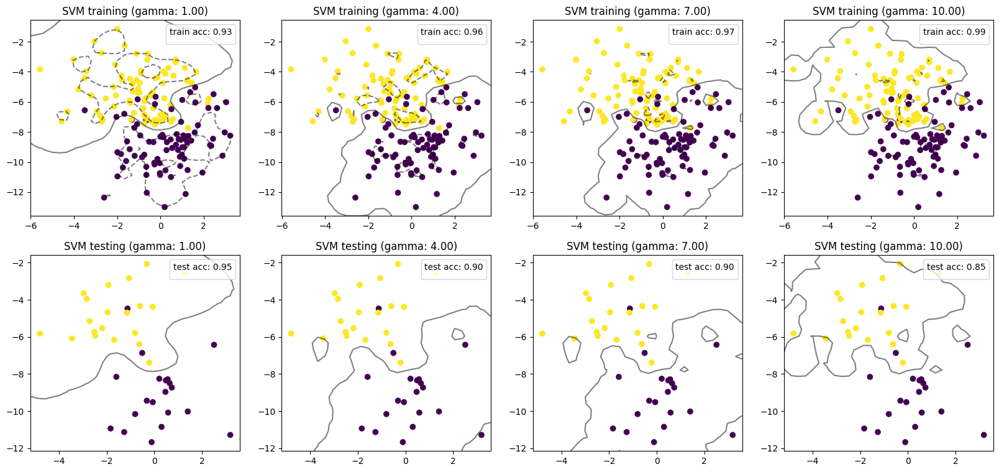
    


##### 2.3 Tune the parameter by the given data with ***GridSearchCV*** function and do the 2 fold cross validation. Please try the parameters below to find the best parameter and plot the result and show the accuracy score. (10%)

(You can find the details of ***GridSearchCV*** function at https://scikit-learn.org/stable/modules/generated/sklearn.model_selection.GridSearchCV.html?highlight=grid%20search#sklearn.model_selection.GridSearchCV)

| | 01 | 02 | 03 |
|:---:|:---:|:---:|:---:|
|***Kernel***| Linear | rbf | poly |
|***degree***| 3 | 5 | - |
|***C***| 0.1 | 1 | 10|
|***gamma***| 1 | 0.1 | 0.01|


```python
# Do not change the data
X, y = make_blobs(n_samples=200, centers=2,random_state=seed, cluster_std=1.5)
```


```python
parameters = list()
parameters.append({'kernel':['linear'], 'degree':[3], 'C':[0.1], 'gamma':[1]})
parameters.append({'kernel':['rbf'], 'degree':[5], 'C':[1], 'gamma':[0.1]})
parameters.append({'kernel':['poly'], 'C':[10], 'gamma':[0.01]})

model = SVC()
model = GridSearchCV(model, parameters)

model.fit(X, y)
model_best = SVC(**model.best_params_)
model_best.fit(X, y)

fig, ax = plt.subplots(1, 1, figsize=(7, 6))
ax.set_title("SVM best parameters" + str(model.best_params_))
ax.scatter(X[:, 0], X[:, 1], c=y)
ax.legend([], title=f'best acc: {model.best_score_:.2f}\nmodel acc: {model_best.score(X, y):.2f}', loc='upper right')
plot_svc_decision_function(model_best, ax)
plt.show()

pd.DataFrame(model.cv_results_).set_index('rank_test_score').sort_index()
```


    
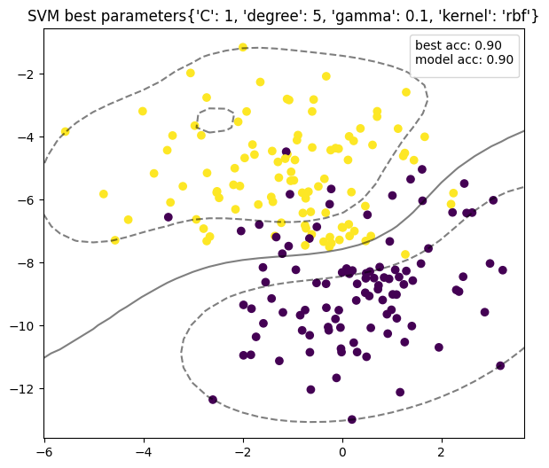
    


<div>
<style scoped>
    .dataframe tbody tr th:only-of-type {
        vertical-align: middle;
    }

    .dataframe tbody tr th {
        vertical-align: top;
    }

    .dataframe thead th {
        text-align: right;
    }
</style>
<table border="1" class="dataframe">
  <thead>
    <tr style="text-align: right;">
      <th></th>
      <th>mean_fit_time</th>
      <th>std_fit_time</th>
      <th>mean_score_time</th>
      <th>std_score_time</th>
      <th>param_C</th>
      <th>param_degree</th>
      <th>param_gamma</th>
      <th>param_kernel</th>
      <th>params</th>
      <th>split0_test_score</th>
      <th>split1_test_score</th>
      <th>split2_test_score</th>
      <th>split3_test_score</th>
      <th>split4_test_score</th>
      <th>mean_test_score</th>
      <th>std_test_score</th>
    </tr>
    <tr>
      <th>rank_test_score</th>
      <th></th>
      <th></th>
      <th></th>
      <th></th>
      <th></th>
      <th></th>
      <th></th>
      <th></th>
      <th></th>
      <th></th>
      <th></th>
      <th></th>
      <th></th>
      <th></th>
      <th></th>
      <th></th>
    </tr>
  </thead>
  <tbody>
    <tr>
      <th>1</th>
      <td>0.000602</td>
      <td>0.000492</td>
      <td>0.000399</td>
      <td>0.000489</td>
      <td>1</td>
      <td>5</td>
      <td>0.1</td>
      <td>rbf</td>
      <td>{'C': 1, 'degree': 5, 'gamma': 0.1, 'kernel': ...</td>
      <td>0.90</td>
      <td>0.925</td>
      <td>0.850</td>
      <td>0.900</td>
      <td>0.900</td>
      <td>0.895</td>
      <td>0.024495</td>
    </tr>
    <tr>
      <th>2</th>
      <td>0.001003</td>
      <td>0.000006</td>
      <td>0.000000</td>
      <td>0.000000</td>
      <td>10</td>
      <td>NaN</td>
      <td>0.01</td>
      <td>poly</td>
      <td>{'C': 10, 'gamma': 0.01, 'kernel': 'poly'}</td>
      <td>0.90</td>
      <td>0.875</td>
      <td>0.850</td>
      <td>0.850</td>
      <td>0.900</td>
      <td>0.875</td>
      <td>0.022361</td>
    </tr>
    <tr>
      <th>3</th>
      <td>0.000401</td>
      <td>0.000491</td>
      <td>0.000400</td>
      <td>0.000490</td>
      <td>0.1</td>
      <td>3</td>
      <td>1</td>
      <td>linear</td>
      <td>{'C': 0.1, 'degree': 3, 'gamma': 1, 'kernel': ...</td>
      <td>0.85</td>
      <td>0.850</td>
      <td>0.825</td>
      <td>0.825</td>
      <td>0.875</td>
      <td>0.845</td>
      <td>0.018708</td>
    </tr>
  </tbody>
</table>
</div>


### 3. Fitting the SVM by the real data. (40%)
#### This question will fit the SVM with real raw data. Please load the file "banana_quality.csv" with pandas package. Try the technique above to reach the highest score.

**\* Please note that the 'Quality' column is the classification label, please convert it to binary labels on your own.**

**Data sources: https://www.kaggle.com/datasets/l3llff/banana**

##### 3-1 Data preprocesssing : Please draw the boxplots of each features and draw another figure with boxplots of each feaures after applying the min max scaling. (10%)

##### Here is the example of figure:


```python
data = pd.read_csv("banana_quality.csv")
for i, x in enumerate(np.unique(data["Quality"])):
    data["Quality"] = data["Quality"].replace(x, i)
    
fig, ax = plt.subplots(2, len(data.columns)-1, figsize=(2.5*len(data.columns)-1, 7))

for i in range(len(data.columns)-1):
    ax[0, i].boxplot(data.iloc[:, i])
    ax[0, i].set_title(data.columns[i])
    
scaler = MinMaxScaler()
data.iloc[:, :-1] = scaler.fit_transform(data.iloc[:, :-1])

for i in range(len(data.columns)-1):
    ax[1, i].boxplot(data.iloc[:, i])
    ax[1, i].set_title(data.columns[i] + " (scaling)")

plt.show()
```


    
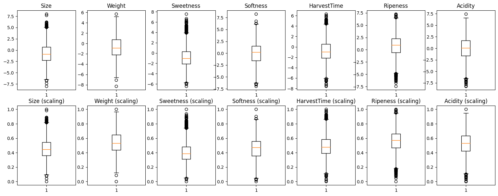
    


```python
sns.pairplot(data, hue='Quality')
plt.show()
```

    c:\Users\K505\.conda\envs\AI_learn\Lib\site-packages\seaborn\axisgrid.py:123: UserWarning: The figure layout has changed to tight
      self._figure.tight_layout(*args, **kwargs)
    


    

    


##### 3-2  Please split the data with traing ratio 0.8, and fit the SVM with your own hyper parameters (at least two sets of parameters). Also, draw the ROC curve and calculate the AUC score of the testing data to compare the performance of two models. (Note. The tutorial considers only one decision threshold, you should think about how to draw the ROC curve with defferent decision threshold) (20%)


```python
X_train, X_test, y_train, y_test = train_test_split(np.array(data.iloc[:, :-1]), np.array(data.iloc[:, -1]), train_size=0.8, random_state=0)

parameters = {'kernel':['linear', 'rbf', 'poly'], 'degree':[3, 10], 'C':[0.1, 1, 10], 'gamma':["auto"]}

model = SVC()
model = GridSearchCV(model, parameters)

model.fit(X_train, y_train)
params = model.cv_results_["params"]

fig, ax = plt.subplots(1, 1, figsize=(12, 9))

for i, x in enumerate(params):
    model_each = SVC(**x)
    model_each.fit(X_train, y_train)
    
    RocCurveDisplay.from_estimator(model_each, X_test, y_test, ax=ax, name="SVM "+ str(model.cv_results_["params"][i]))

fig.suptitle("ROC Curve (testing)", fontsize=20)
plt.legend(fontsize=12)
plt.show()

#pd.DataFrame(model.cv_results_).set_index('rank_test_score').sort_index()
```


    
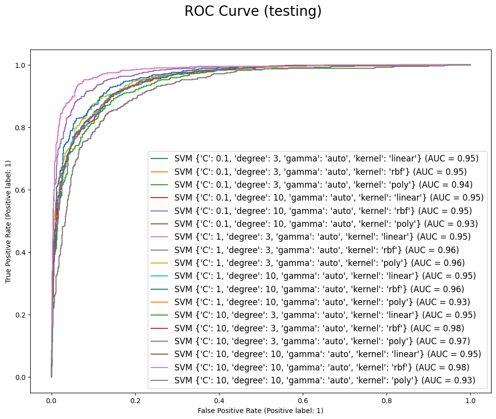
    


##### 3-3 Compare the models from question 3-2 and choose the best parameter and corresponding model to draw the cofusion matrix of training data and testing data, and calculate the accuracy, precision, recall and F1-score. (10%)


```python
model_best = SVC(**model.best_params_)
model_best.fit(X_train, y_train)

fig, ax = plt.subplots(1, 1, figsize=(10, 7))

ConfusionMatrixDisplay.from_estimator(model_best, X_test, y_test, ax=ax)
pred = model_best.predict(X_test)
acc = accuracy_score(y_test, pred)
f1 = f1_score(y_test, pred)
precision = precision_score(y_test, pred)
recall = recall_score(y_test, pred)

fig.suptitle("Confusion Matrix (testing)\n" + str(model.best_params_), fontsize=20)
plt.legend([], title=f'Accuracy: {acc:.2f}\nF1-score: {f1:.2f}\nPrecision: {precision:.2f}\nRecall: {recall:.2f}', fontsize=14)
plt.show()
```


    
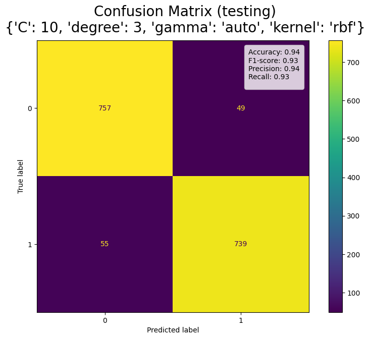
    

