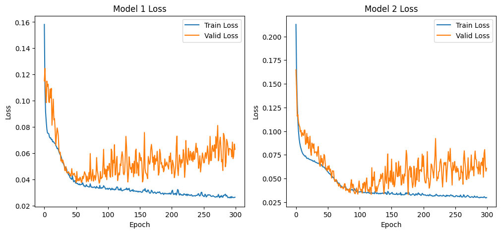
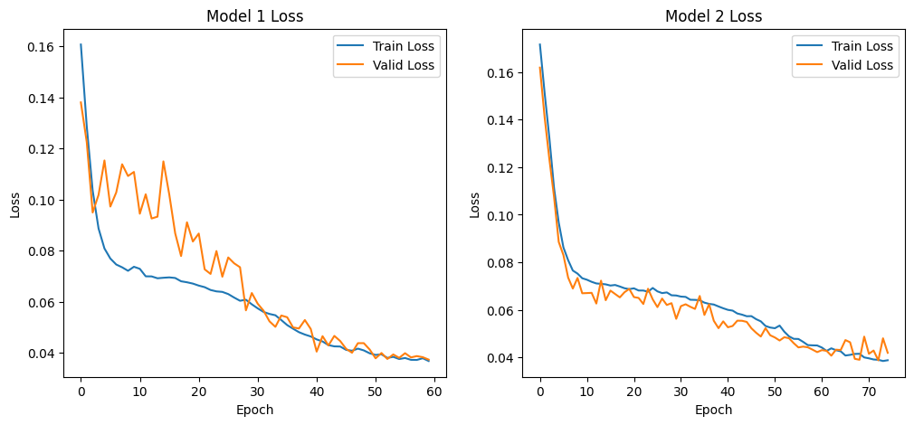

## Homework 02-1: due 2024/04/8 23:59 (30%)

#### - In this part, you should calculate the forward pass and backpropagation manually and there is no need for any coding.

#### - Please scan your hand-writting calculation and save it as HW2-1.pdf

#### - You can check your answer and observe how PyTorch do the backpropagation with the following script.

#### - You can change the iterations in script to observe how the loss and the output change.

##### 1. Please do the forward pass and backpropagation with a neural network as below, the __input is 4__ and the __target is 1__. Also, calculate the quadratic loss, 
##### i.e, $$Loss = \frac{1}{2}(y-y^*)^2$$ 
##### Please __update the parameters twice__, i.e., do two back propagation operations, and use the __learning rate 0.01__, __initial weights 1__ , and __initial bias -0.5__.


#### Please help me organize the calculation results into a table for scoring purposes. The table presentation is as follows:

**First update - weight**

|           | Layer 1      | Layer 2      | Layer 3      |
|-----------|--------------|--------------|--------------|
| Parameter | value_layer1 | value_layer2 | value_layer3 |
| Gradient  | grad_layer1  | grad_layer2  | grad_layer3  |
| Updated   | update_layer1| update_layer2| update_layer3|

**Second update - bias**

|           | Layer 1      | Layer 2      | Layer 3      |
|-----------|--------------|--------------|--------------|
| Parameter | value_layer1 | value_layer2 | value_layer3 |
| Gradient  | grad_layer1  | grad_layer2  | grad_layer3  |
| Updated   | update_layer1| update_layer2| update_layer3|

Please replace `value_layerX`, `grad_layerX`, and `update_layerX` with the actual numerical values for each layer accordingly, the way of presentation is also the same for the second iteration.

### *Answer*

**First update - weight**

|           | Layer 1      | Layer 2      | Layer 3      |
|-----------|--------------|--------------|--------------|
| Parameter |$`W^{[0]} = \left [\begin{matrix} 1 \\ 1 \end{matrix} \right ], b^{[0]} = \left [\begin{matrix} -0.5 \\ -0.5 \end{matrix} \right ]`$|$`W^{[1]} = \left [ \begin{matrix}1 & 1\\ 1 & 1\end{matrix} \right ],  b^{[1]} = \left [\begin{matrix} -0.5 \\ -0.5 \end{matrix} \right ]`$|$`W^{[2]} = \left [ \begin{matrix}1 & 1\end{matrix} \right ],  b^{[2]} = \left [ -0.5 \right ]`$|
| Gradient  |$`W^{[0]} = \left [\begin{matrix} 92 \\ 92 \end{matrix} \right ], b^{[0]} = \left [\begin{matrix} 23 \\ 23 \end{matrix} \right ]`$|$`dLdW^{[1]} = \left [ \begin{matrix}40.25 & 40.25\\ 40.25 & 40.25\end{matrix} \right ],  dLdb^{[1]} = \left [\begin{matrix} 11.5 \\ 11.5 \end{matrix} \right ]`$|$`dLdW^{[2]} = \left [ \begin{matrix}74.75 & 74.75\end{matrix} \right ],  dLdb^{[2]} = \left [ 11.5 \right ]`$|
| Updated   |$`W^{[0]} = \left [\begin{matrix} 0.08 \\ 0.08 \end{matrix} \right ], b^{[0]} = \left [\begin{matrix} -0.73 \\ -0.73 \end{matrix} \right ]`$|$`W^{[1]} = \left [ \begin{matrix}0.5975 & 0.5975\\ 0.5975 & 0.5975\end{matrix} \right ],  b^{[1]} = \left [\begin{matrix} -0.615 \\ -0.615 \end{matrix} \right ]`$|$`W^{[2]} = \left [ \begin{matrix}0.2525 & 0.2525\end{matrix} \right ],  b^{[2]} = \left [ -0.615 \right ]`$|

**Second update - bias**

|           | Layer 1      | Layer 2      | Layer 3      |
|-----------|--------------|--------------|--------------|
| Parameter |$`W^{[0]} = \left [\begin{matrix} 0.08 \\ 0.08 \end{matrix} \right ], b^{[0]} = \left [\begin{matrix} -0.73 \\ -0.73 \end{matrix} \right ]`$|$`W^{[1]} = \left [ \begin{matrix}0.5975 & 0.5975\\ 0.5975 & 0.5975\end{matrix} \right ],  b^{[1]} = \left [\begin{matrix} -0.615 \\ -0.615 \end{matrix} \right ]`$|$`W^{[2]} = \left [ \begin{matrix}0.2525 & 0.2525\end{matrix} \right ],  b^{[2]} = \left [ -0.615 \right ]`$|
| Gradient  |$`W^{[0]} = \left [\begin{matrix} 0 \\ 0 \end{matrix} \right ], b^{[0]} = \left [\begin{matrix} 0 \\ 0 \end{matrix} \right ]`$|$`dLdW^{[1]} = \left [ \begin{matrix}0 & 0\\ 0 & 0\end{matrix} \right ],  dLdb^{[1]} = \left [\begin{matrix} 0 \\ 0 \end{matrix} \right ]`$|$`dLdW^{[2]} = \left [ \begin{matrix}0 & 0\end{matrix} \right ],  dLdb^{[2]} = \left [ -1.615 \right ]`$|
| Updated   |$`W^{[0]} = \left [\begin{matrix} 0.08 \\ 0.08 \end{matrix} \right ], b^{[0]} = \left [\begin{matrix} -0.73 \\ -0.73 \end{matrix} \right ]`$|$`W^{[1]} = \left [ \begin{matrix}0.5975 & 0.5975\\ 0.5975 & 0.5975\end{matrix} \right ],  b^{[1]} = \left [\begin{matrix} -0.615 \\ -0.615 \end{matrix} \right ]`$|$`W^{[2]} = \left [ \begin{matrix}0.2525 & 0.2525\end{matrix} \right ],  b^{[2]} = \left [ -0.59885 \right ]`$|


```python
import torch
import torch.nn as nn
import torch.optim as optim
from collections import OrderedDict
```


```python
X = torch.tensor([4], dtype= torch.float32)
y = torch.tensor([1], dtype= torch.float32)
```


```python
# Half of the sum square error
def loss(y, pred):
    return ((pred-y)**2).sum()/2
```


```python
# Show parameters
def show_parameters(i, X, model):
    print(f"Iters {i}")
    print("Input:")
    print(X)
    for layer_name, layers in model.named_modules():
        print("-----------------------")
        if not isinstance(layers, nn.Sequential):
            for param_name, param in layers.named_parameters():
                print(f"{layer_name} {param_name} {param}")
                print(f"{layer_name} {param_name} Gradient")
                print(param.grad)
            print(f"{layer_name} output:")
            X = layers(X)
            print(X)
            
    print("===============================================")
```


```python
def initialize_weights(model):
    for name, i in model.named_modules():
        if isinstance(i, nn.Linear):
            nn.init.constant_(i.weight.data, 1)
            nn.init.constant_(i.bias.data, -0.5)
```


```python
model = nn.Sequential(OrderedDict([("Layer1", nn.Linear(1, 2)), 
                                   ("ReLU1", nn.ReLU()),
                                   ("Layer2", nn.Linear(2, 2)), 
                                   ("ReLU2", nn.ReLU()),
                                   ("Layer3", nn.Linear(2, 1))]))
initialize_weights(model)
lr = 0.01
n_iters = 2
optimizer = optim.SGD(model.parameters(), lr=lr, momentum=0)
loss_list = []
for i in range(n_iters):
    optimizer.zero_grad()
    pred = model(X)
    l = loss(pred, y)
    loss_list.append(l.detach().numpy())
    l.backward()
    show_parameters(i, X, model)
    optimizer.step()
```

    Iters 0
    Input:
    tensor([4.])
    -----------------------
    -----------------------
    Layer1 weight Parameter containing:
    tensor([[1.],
            [1.]], requires_grad=True)
    Layer1 weight Gradient
    tensor([[92.],
            [92.]])
    Layer1 bias Parameter containing:
    tensor([-0.5000, -0.5000], requires_grad=True)
    Layer1 bias Gradient
    tensor([23., 23.])
    Layer1 output:
    tensor([3.5000, 3.5000], grad_fn=<AddBackward0>)
    -----------------------
    ReLU1 output:
    tensor([3.5000, 3.5000], grad_fn=<ReluBackward0>)
    -----------------------
    Layer2 weight Parameter containing:
    tensor([[1., 1.],
            [1., 1.]], requires_grad=True)
    Layer2 weight Gradient
    tensor([[40.2500, 40.2500],
            [40.2500, 40.2500]])
    Layer2 bias Parameter containing:
    tensor([-0.5000, -0.5000], requires_grad=True)
    Layer2 bias Gradient
    tensor([11.5000, 11.5000])
    Layer2 output:
    tensor([6.5000, 6.5000], grad_fn=<AddBackward0>)
    -----------------------
    ReLU2 output:
    tensor([6.5000, 6.5000], grad_fn=<ReluBackward0>)
    -----------------------
    Layer3 weight Parameter containing:
    tensor([[1., 1.]], requires_grad=True)
    Layer3 weight Gradient
    tensor([[74.7500, 74.7500]])
    Layer3 bias Parameter containing:
    tensor([-0.5000], requires_grad=True)
    Layer3 bias Gradient
    tensor([11.5000])
    Layer3 output:
    tensor([12.5000], grad_fn=<AddBackward0>)
    ===============================================
    Iters 1
    Input:
    tensor([4.])
    -----------------------
    -----------------------
    Layer1 weight Parameter containing:
    tensor([[0.0800],
            [0.0800]], requires_grad=True)
    Layer1 weight Gradient
    tensor([[0.],
            [0.]])
    Layer1 bias Parameter containing:
    tensor([-0.7300, -0.7300], requires_grad=True)
    Layer1 bias Gradient
    tensor([0., 0.])
    Layer1 output:
    tensor([-0.4100, -0.4100], grad_fn=<AddBackward0>)
    -----------------------
    ReLU1 output:
    tensor([0., 0.], grad_fn=<ReluBackward0>)
    -----------------------
    Layer2 weight Parameter containing:
    tensor([[0.5975, 0.5975],
            [0.5975, 0.5975]], requires_grad=True)
    Layer2 weight Gradient
    tensor([[0., 0.],
            [0., 0.]])
    Layer2 bias Parameter containing:
    tensor([-0.6150, -0.6150], requires_grad=True)
    Layer2 bias Gradient
    tensor([0., 0.])
    Layer2 output:
    tensor([-0.6150, -0.6150], grad_fn=<AddBackward0>)
    -----------------------
    ReLU2 output:
    tensor([0., 0.], grad_fn=<ReluBackward0>)
    -----------------------
    Layer3 weight Parameter containing:
    tensor([[0.2525, 0.2525]], requires_grad=True)
    Layer3 weight Gradient
    tensor([[0., 0.]])
    Layer3 bias Parameter containing:
    tensor([-0.6150], requires_grad=True)
    Layer3 bias Gradient
    tensor([-1.6150])
    Layer3 output:
    tensor([-0.6150], grad_fn=<AddBackward0>)
    ===============================================
    
## Homework 02-2: due 2024/04/08 23:59 (70%)

### - Tutorial : https://machinelearningmastery.com/pytorch-tutorial-develop-deep-learning-models/

### - After you go through the tutorials, you should be able to work on this assignment.

### - Please answer the following questions and work directly on this jupyter notebook.

### - Make sure the code can be run and show the result and figures properly.

### - Please write down your observation with markdown in this notebook briefly.


#### You will train a regression model in this part. The data is **Concrete Compressive Strength Dataset**, you can find the details of each column at https://archive.ics.uci.edu/ml/datasets/concrete+compressive+strength. In this part, please predict the **strength of concrete**.


```python
# Import necessory modules
%matplotlib inline
import pandas as pd
import numpy as np
import random
import torch
import torch.nn as nn
import torch.optim as optim
from torch.utils.data import Dataset, DataLoader
import matplotlib.pyplot as plt
from tqdm import tqdm
from sklearn.preprocessing import MinMaxScaler
```


```python
# For reproduce the result
torch.manual_seed(1220)
random.seed(1220)
np.random.seed(1220)
```


```python
device = (
    "cuda"
    if torch.cuda.is_available()
    else "mps"
    if torch.backends.mps.is_available()
    else "cpu"
)
print(f"Using {device} device")
```

    Using cuda device
    

### 1. Define the model and dataset (10%)

#### 1.1 Please follow the Step 2 from the tutorial to create a class ***ConcreteDataset*** to load the data you need and also do the ***Min-Max scaling*** to the ***feature and label***. (5%)


```python
class Min_Max_Scaler:
    def __init__(self):
        None

    def fit(self, data):
        self.min = np.min(data, axis=0)
        self.max = np.max(data, axis=0)

    def transform(self, data):
        scaling_data = data.copy()
        for i in range(data.shape[1]):
            scaling_data[:, i] = 2 * ((data[:, i] - self.min[i]) / (self.max[i] - self.min[i])) - 1
        return scaling_data
    
    def fit_transform(self, data):
        self.fit(data)
        return self.transform(data)

    def y_inverse_transform(self, scaling_y):
        return (scaling_y + 1) * (self.max[-1] - self.min[-1]) / 2 + self.min[-1]
```


```python
class ConcreteDataset(Dataset):
   def __init__(self, data):
      self.X = torch.tensor(data[:, :-1]).to(torch.float32)
      self.y = torch.tensor(data[:, -1]).to(torch.float32)
    
   def __len__(self):
      return len(self.X)
    
   def __getitem__(self, idx):
      return self.X[idx], self.y[idx]
```

#### 1.2 By following the tutorial, try to create a class ***MLP(Neural Network)*** with ***three hidden layers*** as your network architecture. Also, for the convenience of implementation, please set the numbers of hidden nodes and the activation functions as input variables to the foward functions.(5%) 


```python
class MLP_1(nn.Module):
    def __init__(self):
        super().__init__()
        self.net = nn.Sequential(
            nn.Linear(8, 256),
            nn.Tanh(),
            nn.Linear(256, 64),
            nn.Tanh(),
            nn.Linear(64, 8),
            nn.Tanh(),
            nn.Linear(8, 1),
            nn.Tanh(),
        )
        
    def forward(self, X):
        outputs = self.net(X)
        return outputs
```


```python
class MLP_2(nn.Module):
    def __init__(self):
        super().__init__()
        self.net = nn.Sequential(
            nn.Linear(8, 64),
            nn.Tanh(),
            nn.Linear(64, 16),
            nn.Tanh(),
            nn.Linear(16, 8),
            nn.Tanh(),
            nn.Linear(8, 1),
        )
        
    def forward(self, X):
        outputs = self.net(X)
        return outputs
```

### 2. Train the model (60%)

#### 2.1 Please load the ***train.csv/ validation.csv*** in ./data, and turn them into dataloader with batch size 64 and determine whether shuffle or not. (5%)


```python
train_data = np.array(pd.read_csv("./data/train.csv"))
test_data = np.array(pd.read_csv("./data/test.csv"))
valid_data = np.array(pd.read_csv("./data/validation.csv"))

scaler = Min_Max_Scaler()

train_data_scaled = scaler.fit_transform(train_data)
test_data_scaled = scaler.transform(test_data)
valid_data_scaled = scaler.transform(valid_data)

train_data_loader = DataLoader(ConcreteDataset(train_data_scaled), batch_size=64, shuffle=True)
test_data_loader = DataLoader(ConcreteDataset(test_data_scaled))
valid_data_loader = DataLoader(ConcreteDataset(valid_data_scaled), batch_size=64, shuffle=True)
```

#### 2.2 Create two MLP model from the table below and ***print the model*** (10%):
| | Hidden Layer 1| Hidden Layer 2| Hidden Layer 3| Activation in each hidden nodes | Activation for output |
|:---:|:---:|:---:|:---:|:---:|:---:|
|***Model1***| 256 | 64 | 8 | Tanh | Tanh |
|***Model1***| 64 | 16 | 8 | Tanh | Identity |


```python
model_1 = MLP_1().to(device)
model_2 = MLP_2().to(device)
print("Model 1:\n", model_1, "\n\nModel 1:\n", model_2)
```

    Model 1:
     MLP_1(
      (net): Sequential(
        (0): Linear(in_features=8, out_features=256, bias=True)
        (1): Tanh()
        (2): Linear(in_features=256, out_features=64, bias=True)
        (3): Tanh()
        (4): Linear(in_features=64, out_features=8, bias=True)
        (5): Tanh()
        (6): Linear(in_features=8, out_features=1, bias=True)
        (7): Tanh()
      )
    ) 
    
    Model 1:
     MLP_2(
      (net): Sequential(
        (0): Linear(in_features=8, out_features=64, bias=True)
        (1): Tanh()
        (2): Linear(in_features=64, out_features=16, bias=True)
        (3): Tanh()
        (4): Linear(in_features=16, out_features=8, bias=True)
        (5): Tanh()
        (6): Linear(in_features=8, out_features=1, bias=True)
      )
    )
    

#### 2.3 Train the above two models with the same hyperpameters below and do the validation in every epoch. Choose the appropriate type of loss function according to the task. (25%)
##### (Note. You should record the training/validation loss every epoch)


| | Learning rate | epochs | optimizer | momentum |
|:---:|:---:|:---:|:---:|:---:|
|***Hyperparameter***| 0.01 | 300 | SGD | 0.9 |


```python
loss_fn = nn.MSELoss()
optimizer_1 = torch.optim.SGD(model_1.parameters(), lr=0.01, momentum=0.9)
optimizer_2 = torch.optim.SGD(model_2.parameters(), lr=0.01, momentum=0.9)
```


```python
def train(dataloader, model, loss_fn, optimizer):
    epoch_loss = 0.
    model.train()
    for batch, (X, y) in enumerate(dataloader):
        X, y = X.to(device), y.to(device)

        pred = model(X)
        loss = loss_fn(pred, y.unsqueeze(1))

        optimizer.zero_grad()
        loss.backward()
        optimizer.step()
        epoch_loss += loss.item()
        
    epoch_loss /= len(dataloader)
    return epoch_loss

def valid(dataloader, model, loss_fn):
    epoch_loss = 0.
    model.eval()
    with torch.no_grad():
        for X, y in dataloader:
            X, y = X.to(device), y.to(device)

            pred = model(X)
            loss = loss_fn(pred, y.unsqueeze(1))
            epoch_loss += loss.item()

        epoch_loss /= len(dataloader)
    return epoch_loss
```


```python
epochs = 300
loop = tqdm(range(epochs))
train_loss_1, valid_loss_1, train_loss_2, valid_loss_2 = np.array([]), np.array([]), np.array([]), np.array([])
for i in loop:
    train_loss_1 = np.append(train_loss_1, train(train_data_loader, model_1, loss_fn, optimizer_1))
    valid_loss_1 = np.append(valid_loss_1, valid(valid_data_loader, model_1, loss_fn))
    train_loss_2 = np.append(train_loss_2, train(train_data_loader, model_2, loss_fn, optimizer_2))
    valid_loss_2 = np.append(valid_loss_2, valid(valid_data_loader, model_2, loss_fn))
    loop.set_description(f"Epoch {i+1}/{epochs}")
    loop.set_postfix(model_1_train_loss=f"{train_loss_1[-1]:.6f}", model_1_valid_loss=f"{valid_loss_1[-1]:.6f}", model_2_train_loss=f"{train_loss_2[-1]:.6f}", model_2_valid_loss=f"{valid_loss_2[-1]:.6f}")
```

    Epoch 300/300: 100%|██████████| 300/300 [00:13<00:00, 22.82it/s, model_1_train_loss=0.026363, model_1_valid_loss=0.062840, model_2_train_loss=0.029884, model_2_valid_loss=0.060739]
    

#### 2.4 Please include the plot that shows how the training/validation loss vary with the training epoch. Show the plots using the above two models and write down the observation. (5%)


```python
fig, ax = plt.subplots(1, 2, figsize=(12, 5))
ax[0].set_title("Model 1 Loss")
ax[0].plot(train_loss_1, label="Train Loss")
ax[0].plot(valid_loss_1, label="Valid Loss")
ax[1].set_title("Model 2 Loss")
ax[1].plot(train_loss_2, label="Train Loss")
ax[1].plot(valid_loss_2, label="Valid Loss")
for i in range(2):
    ax[i].set_xlabel("Epoch")
    ax[i].set_ylabel("Loss")
    ax[i].legend()
plt.show()
```


    

    


#### 2.5 From the observation of the previous question, please determine an appropriate epoch and retrain the two models to avoid overfitting. Also, draw the loss plot of two models and save the last model as ***model1.pth*** and ***model2.pth***. (10%)
##### (Note. You should reload the models and the optimizer, otherwise, you will resume from the previous stop.)


```python
epochs1 = 60
epochs2 = 75
loop1 = tqdm(range(epochs1))
loop2 = tqdm(range(epochs2))

model_1 = MLP_1().to(device)
model_2 = MLP_2().to(device)
loss_fn = nn.MSELoss()
optimizer_1 = torch.optim.SGD(model_1.parameters(), lr=0.01, momentum=0.9)
optimizer_2 = torch.optim.SGD(model_2.parameters(), lr=0.01, momentum=0.9)
train_loss_1, valid_loss_1, train_loss_2, valid_loss_2 = np.array([]), np.array([]), np.array([]), np.array([])

for i in loop1:
    train_loss_1 = np.append(train_loss_1, train(train_data_loader, model_1, loss_fn, optimizer_1))
    valid_loss_1 = np.append(valid_loss_1, valid(valid_data_loader, model_1, loss_fn))
    loop1.set_description(f"Model 1 Epoch {i+1}/{epochs}")
    loop1.set_postfix(model_1_train_loss=f"{train_loss_1[-1]:.6f}", model_1_valid_loss=f"{valid_loss_1[-1]:.6f}")

for i in loop2:
    train_loss_2 = np.append(train_loss_2, train(train_data_loader, model_2, loss_fn, optimizer_2))
    valid_loss_2 = np.append(valid_loss_2, valid(valid_data_loader, model_2, loss_fn))
    loop2.set_description(f"Model 2 Epoch {i+1}/{epochs}")
    loop2.set_postfix(model_2_train_loss=f"{train_loss_2[-1]:.6f}", model_2_valid_loss=f"{valid_loss_2[-1]:.6f}")

torch.save(model_1.state_dict(), "model1.pth")
torch.save(model_2.state_dict(), "model2.pth")
print("Saved PyTorch Model State to \"model1.pth\", and \"model2.pth\"")

fig, ax = plt.subplots(1, 2, figsize=(12, 5))
ax[0].set_title("Model 1 Loss")
ax[0].plot(train_loss_1, label="Train Loss")
ax[0].plot(valid_loss_1, label="Valid Loss")
ax[1].set_title("Model 2 Loss")
ax[1].plot(train_loss_2, label="Train Loss")
ax[1].plot(valid_loss_2, label="Valid Loss")
for i in range(2):
    ax[i].set_xlabel("Epoch")
    ax[i].set_ylabel("Loss")
    ax[i].legend()
plt.show()
```

    Model 1 Epoch 60/300: 100%|██████████| 60/60 [00:01<00:00, 42.73it/s, model_1_train_loss=0.036823, model_1_valid_loss=0.037379]
    Model 2 Epoch 75/300: 100%|██████████| 75/75 [00:03<00:00, 23.31it/s, model_2_train_loss=0.038791, model_2_valid_loss=0.041928]
    

    Saved PyTorch Model State to "model1.pth", and "model2.pth"
    


    

    


#### 2.6 Please load the checkpoints saved from previous question and calculate the mean squared error on test dataset for two models respectively. Also, make a dataframe with target and prediction like below and save it as ***regression.csv*** (5%)
|Target|Model1|Model2|
|:---:|:---:|:---:|
|24.05|26.35|27.04|
|21.67|32.78|21.95|


```python
def test(dataloader, model, loss_fn):
    model.eval()
    pred_all = np.array([])
    test_loss = 0
    with torch.no_grad():
        for X, y in dataloader:
            X, y = X.to(device), y.to(device)
            pred = model(X)
            test_loss += loss_fn(pred, y.unsqueeze(1)).item()
            pred_all = np.append(pred_all, pred.cpu().numpy())
    test_loss /= len(dataloader)
    return test_loss, pred_all
```


```python
model_1.load_state_dict(torch.load("model1.pth"))
model_2.load_state_dict(torch.load("model2.pth"))
model_1.eval()
model_2.eval()

test1_loss, pred1 = test(test_data_loader, model_1, loss_fn)
test2_loss, pred2 = test(test_data_loader, model_2, loss_fn)
print(f"Test 1 average loss: {test1_loss:>8f}\nTest 2 average loss: {test2_loss:>8f}")

pred1 = scaler.y_inverse_transform(pred1)
pred2 = scaler.y_inverse_transform(pred2)

regression_result = pd.DataFrame({"Target":test_data[:, -1], "Model1": pred1, "Model2": pred2})
regression_result
```

    Test 1 average loss: 0.032117
    Test 2 average loss: 0.032354
    


<div>
<style scoped>
    .dataframe tbody tr th:only-of-type {
        vertical-align: middle;
    }

    .dataframe tbody tr th {
        vertical-align: top;
    }

    .dataframe thead th {
        text-align: right;
    }
</style>
<table border="1" class="dataframe">
  <thead>
    <tr style="text-align: right;">
      <th></th>
      <th>Target</th>
      <th>Model1</th>
      <th>Model2</th>
    </tr>
  </thead>
  <tbody>
    <tr>
      <th>0</th>
      <td>26.06</td>
      <td>36.968701</td>
      <td>34.688690</td>
    </tr>
    <tr>
      <th>1</th>
      <td>10.35</td>
      <td>15.613440</td>
      <td>9.341841</td>
    </tr>
    <tr>
      <th>2</th>
      <td>74.99</td>
      <td>56.975096</td>
      <td>54.572150</td>
    </tr>
    <tr>
      <th>3</th>
      <td>59.00</td>
      <td>53.578528</td>
      <td>47.857256</td>
    </tr>
    <tr>
      <th>4</th>
      <td>52.12</td>
      <td>42.784206</td>
      <td>42.051085</td>
    </tr>
    <tr>
      <th>...</th>
      <td>...</td>
      <td>...</td>
      <td>...</td>
    </tr>
    <tr>
      <th>98</th>
      <td>33.40</td>
      <td>37.497534</td>
      <td>33.374781</td>
    </tr>
    <tr>
      <th>99</th>
      <td>39.27</td>
      <td>38.806921</td>
      <td>34.188080</td>
    </tr>
    <tr>
      <th>100</th>
      <td>18.13</td>
      <td>20.937054</td>
      <td>17.704983</td>
    </tr>
    <tr>
      <th>101</th>
      <td>33.01</td>
      <td>25.592991</td>
      <td>21.787976</td>
    </tr>
    <tr>
      <th>102</th>
      <td>33.72</td>
      <td>38.864240</td>
      <td>33.727626</td>
    </tr>
  </tbody>
</table>
<p>103 rows × 3 columns</p>
</div>


```python
regression_result.to_csv("regression.csv", index=False)
print("Saved regression result to \"regression.csv\"")
```

    Saved regression result to "regression.csv"
    

