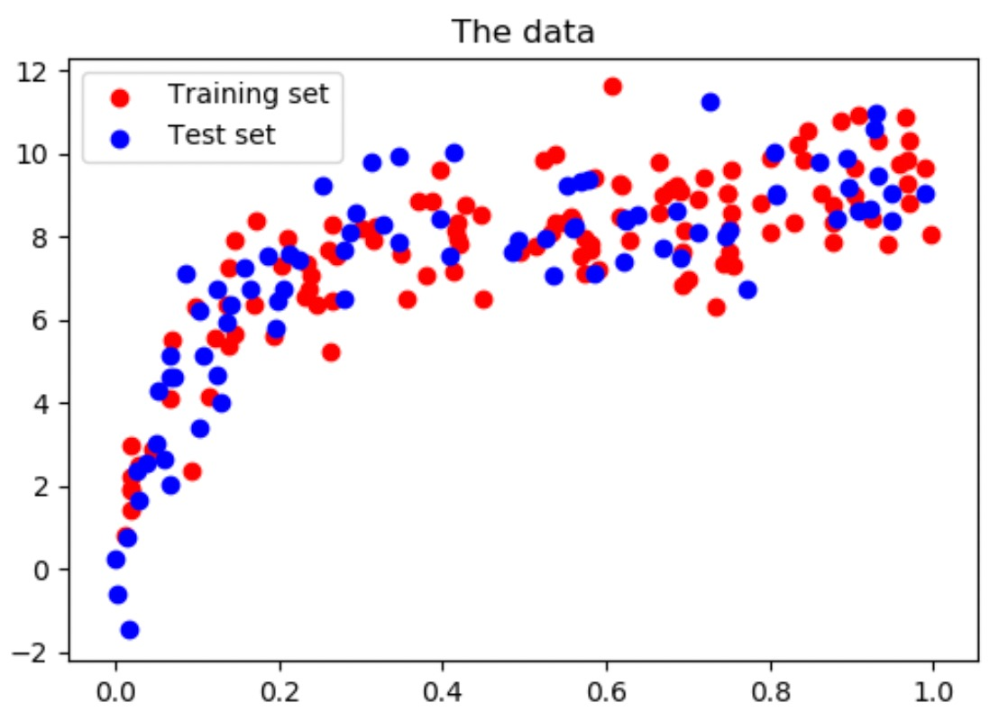
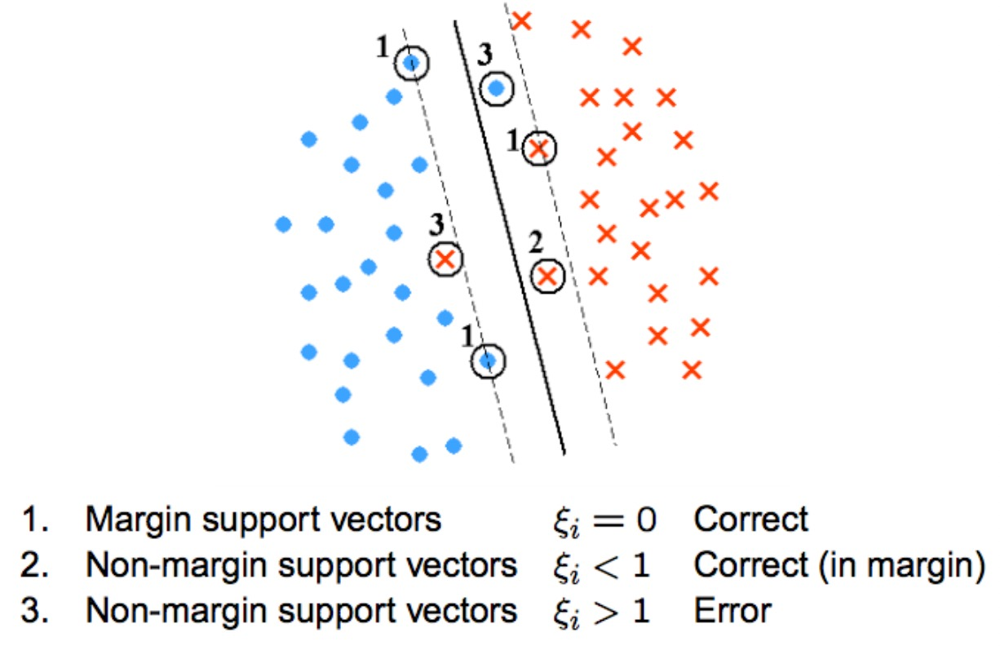
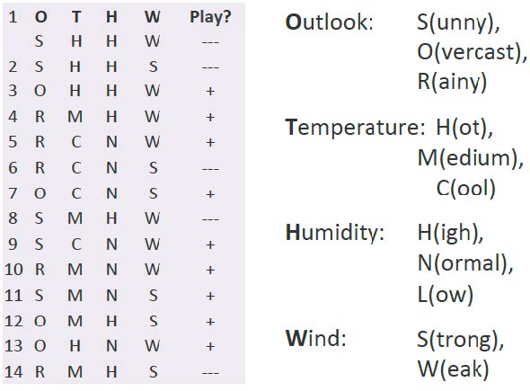

# Deep Learning in Computer Version Midterm Note

# Introduction (02/22)

## What is AI, Machine Learning (ML) and Deep Learning (DL)

**Artificial Intelligence (AI):** 
- AI is the broadest concept, encompassing any technique that enables machines to mimic human behavior and intelligence.   
- AI includes everything from simple algorithms that solve specific problems to complex systems that can understand and interpret human language.
    
**Machine Learning (ML):** 
- ML is a specific subset of AI focused on giving machines the ability to learn from data without being explicitly programmed for every task. 
- ML covers a range of data-driven algorithms that learn from data and improve over time.

**Deep Learning (DL):** 
- DL is a subset of ML that involves deep neural networks, which are algorithms inspired by the structure and function of the human brain. 
- DL focuses on learning data representations and patterns at multiple levels of abstraction, allowing for more complex and nuanced interpretations and decisions.

## Categories of Machine Learning

**Supervised Learning:** 
- Supervised learning involves training a model on a ***labeled dataset***, where each training example is paired with an output label. The goal is for the model to learn to predict the output associated with new inputs.

**Unsupervised Learning:** 
- Unsupervised learning involves training a model on data that has ***not been labeled, formatted, or classified***. The model tries to learn the underlying structure or distribution in the data to learn more about the data itself.

**Reinforcement Learning:** 
- Reinforcement learning is about taking suitable action to ***maximize reward*** in a particular situation. It is employed by various software and machines to find the best possible behavior or path it should take in a specific situation.

## Computer Vision

Make the computers understand ***images*** and ***videos***. Let computers identify the relationship (eg. position) between the objects in the image through image processing.

**More Applications: Vision in Space:**

- Vision systems (JPL) used for several tasks
- Panorama stitching
- 3D terrain modeling
- Obstacle detection, position tracking
- For more, read “Computer Vision on Mars” by Matthies et al.
  

# Data Representations and Normalization (02/26~02/29)

## Normalization

What if different input features have ***different order of magnitudes***?

- Ex: Let $x[i, j]$ denotes the $j^{th}$ feature of $i^{th}$ input sample.

    | Dimension (j) | Range       |
    | ------------- | ----------- |
    | $x[:, 1]$     | $[0, 100]$  |
    | $x[:, 2]$     | $[0, 1]$    |
    | $x[:, 3]$     | $[-10, 10]$ |

Using the original values of input features may result in poor
performance due to:

- Dominance of feature: dominated by features of larger values.
- Numerical stability
- Convergence issues: converge to local/global minimum slower.

Need to do ***scaling*** on the inputs/outputs, i.e., `normalization`, `MinMaxScaler`, `StandardScaler`!

## Normalization Techniques

Recall: $𝑥[𝑖, 𝑗]$ denotes the $𝑗^{th}$ feature of $i^{th}$ input sample.

**Min-Max Normalization**

- $x[:, j]_{normalization} = \frac{x[:, j] - min(x[:, j])}{max(x[:, j]) - min([:, j])}$
- Feature-wise scaling, across all the samples
- Most common scaling technique

## Normalization in Classification and Regression

**Classification**

- Usually no scaling in outputs.
- Need scaling in inputs.

**Regression**

- Usually need to scale in ***both inputs and outputs***.
- The train, vaild and test data should be scaled.

**Note:**

1.	Apply feature transformation.
2.	Scale the inputs and outputs using the same scaling factors employed during training.
3.	Scale the prediction back to the original values.

# Model Evaluation (02/29~03/04)

## Assumption in Machine Learning

How you determine your training dataset so that your model works on the unseen(test) dataset?

- Training and testing dataset must be ***representative enough***
- The training and testing datasets are on the same distribution. 

    

## Robustness Evaluation

If your model works perfectly on your training data and testing data, does this mean that you have a perfect model?

- The answer is ***NO***, this situation can be considered to ***overfitting***.

In the other word, you should know:

- How ***bad*** your model could be when you change your selection of training and testing data. 

Otherwise, you should repeated trials to change the selected training and testing datasets, and show statistics of the performance of your model on the testing dataset.

## Overfitting

Model works well on training dataset, but performs
poor on testing dataset. Then, model fits too much on the training samples.

- Blue Dots: 2D feature vectors of men images
- Red Dots: 2D feature vectors of women images
- Green Curve: an `overfitted` model
- Black Curve: a more general model

    

### Reasons and Solutions to Overfitting

1. Training dataset is not representative:
   
    - Re-select the training samples.

2. Model complexity is high:

    - Reduce the model complexity (the depth of layers), reduce the number of trainable parameters.

3. Train too much:

    - Introduce a validation dataset to determine when to stop training.
    - Add stopping point, when the error on validation dataset start to increase.

    

## Remarks about Overfitting

### *Reasons* of overfitting:

- Training dataset is not representative enough.
- Model complexity is too high.
- Train too much on the training dataset.

### *Solutions* to overfitting:

- Re-select the training samples.
- Reduce the complexity of the model.
- Use less number of training epochs.
- Use a validation dataset to evaluate whether overfitting occurs.

## Confusion Matrix and Accuracy

Take a extreme example, suppose your model achieves an accuracy of 99%. Is this model good?

There is no answer. We need a baseline reference.

- Example: dataset consists of 99 cat images and 1 non-cat image. You could have a classifier that predict everything into cats.
    
    Metric “accuracy” is meaningless when dataset is highly unbalanced.

    $Accuraccy = \frac{TP+TN}{TP+TN+FP+FN} = \frac{99}{99+1} = 99.0%$

    

    <table border="1" class="dataframe">
    <thead>
        <tr>
          <th></th>
          <th></th>
          <th colspan="2" halign="left">Actual</th>
        </tr>
        <tr>
          <th></th>
          <th></th>
          <th>Cat</th>
          <th>Non-Cat</th>
        </tr>
      </thead>
      <tbody>
        <tr>
          <th rowspan="2" valign="top">Predicted</th>
          <th>Cat</th>
          <td>99 (TP)</td>
          <td>1 (FP)</td>
        </tr>
        <tr>
          <th>Non-Cat</th>
          <td>0 (FN)</td>
          <td>0 (TN)</td>
        </tr>
      </tbody>
    </table>
    

- The confusion matrix is obtained from a ***specific decision threshold***.

- By varying the ***decision threshold***, you obtain the TPR as a function of FPR, which is the receiver operating characteristic (ROC) curve.

    True positive rate (TPR, or Recall) $= \frac{TP}{TP+FN} = \frac{99}{99+0} = 1$

    False positive rate (FPR) $= \frac{FP}{FP+TN} = \frac{0}{1+0} = 1$

    Precision $= \frac{TP}{TP+FP} = \frac{99}{99+1} = 0.99$

# Support Vector Machine and K-Nearest Neighbor(03/07~03/14)

## Introduction of Support Vector Machine (SVM)

SVM is a very popular algorithm in machine learning (ML) community.

- Can do ***classification*** and ***regression*** problems.
- Find the ***hyperplane (Decision Boundary)*** that separates different classes.
- May require a ***kernel function*** to project the data into higher dimension spaces.

## Hard SVM (Linearly-Separable Case)

Recall on a 2D plane, we define a line with the equation:

- $𝑙: 𝐴𝑥 + 𝐵𝑦 + 𝑏 = 0$
- In SVM, we usually denote the inputs as $𝒙_{i} = [x_{1}, x_{2},...,x_{p}]^{T}$, and the corresponding label as $𝒙_{i} = [1 or -1]$ for binary classification.
- Assume the input space is 2D (i.e., 𝑝 = 2), the same line 𝑙 can be represented as:

    

- Define the hyperplane: $H_{0} = w^{T}_{0}x + b_{0} = 0$, where $w=\begin{bmatrix} A & B \end{bmatrix}$, we want to find the optimal 𝒘 so that the ***margin*** is the largest. `The large margin can avoid overfitting.`

How to compute the margin?

$\left \| x_{+}-x_{-} \right \| \cdot cos\theta$

$=\left \| x_{+}-x_{-} \right \|\cdot \frac{(x_{+}-x_{-})\cdot w_{0}}{\left \| x_{+}-x_{-} \right \|\cdot \left \| w_{0} \right \|}$

$=\frac{(x_{+}-x_{-})\cdot w_{0}}{\left \| w_{0} \right \|}$

$=\frac{(1-b_{0})-(-1-b_{0})}{\left \| w_{0} \right \|} = \frac{2}{\left \| w_{0} \right \|}$

- To maximize the margin, we need to minimize $\left \| w_{0} \right \|$.
- Support vectors: points on $H_{1}$ and $H_{2}$ are $x_{+}$ and $x_{-}$.

Final:

Formulation:

$min(\frac{1}{2}w^{T}w) = \frac{1}{2}\left \| w \right \|^{2}$

subject to $y_{i}(w^{T}x_{i}+b)\geq 1, i = 1,...,n$

## Soft SVM (Non-Separable Case)

What if there are noise/outliers?

Formulation:

$min(\frac{1}{2}w^{T}w) + C\sum_{i=1}^{n} \zeta_{i}$

subject to $y_{i}(w^{T}x_{i}+b)\geq 1-\zeta_{i}, \zeta_{i}\geq 0, i = 1,...,n$

## Soft SVM with Kernel Function (Non-Separable Case)

What if the data cannot be separable in the original space?

Use a ***kernel*** function $\phi (\cdot )$ to map the inputs into a higher dimensional space to be separated with a hyperplane.

Formulation:

$min(\frac{1}{2}w^{T}w) + C\sum_{i=1}^{n} \zeta_{i}$

subject to $y_{i}(w^{T}\phi (x_{i})+b)\geq 1-\zeta_{i}, \zeta_{i}\geq 0, i = 1,...,n$

## Remark

- Soft SVM with kernel function:

    $min(\frac{1}{2}w^{T}w) + C\sum_{i=1}^{n} \zeta_{i}$

    subject to $y_{i}(w^{T}\phi (x_{i})+b)\geq 1-\zeta_{i}, \zeta_{i}\geq 0, i = 1,...,n$

-  However, in practice the above optimization problem is solved by its ***dual form***. The dual form of SVM leverages the ***kernel trick***, Making the optimization process more efficient and can be implemented using gradient descent. Instead of optimizing 𝒘 explicitly, the dual form only depends on the samples $x_{i}$ through ***kernel products***.
- There are other variants of SVM algorithms. SVM can also be used in regression problems.
- Further reading:
    - Ch. 11.5 in: http://ciml.info/dl/v0_99/ciml-v0_99-ch11.pdf
    - scikit-learn: https://scikit-learn.org/stable/modules/svm.html#mathematical-formulation

## Hyperparameters

Hyperparameter: any parameter in the algorithm that may affect the performance. Some of the hyperparameters include:

- The penalty 𝐶.
- The kernel function. E.g.: linear, polynomial, Radial Basis Function (RBF)
- Parameters in the kernel function.

More detial is on HW1.

## K-nearest Neighbor

Main concept: assign the label to the test sample based on the majority vote using the K nearest samples in the training dataset.

- Training samples: blue circle and red cross.
- Testing sample: green square
- If K = 3, testing sample is classified as red cross.
- If K = 5, testing sample is classified as blue circle.

    

Steps:

1. Prepare a training dataset.
2. Apply appropriate feature transformation.
3. Given a testing sample, compute the distance between the testing sample and each training sample.
4. Sort the distances, and choose the K value.
5. Assign labels based on the majority vote of the K-nearest neighbors.

Hyperparameter:

- The K value.
- The feature transformation you use.
- The distance metric you use.

Brainstorming:

- How does the K value relate to overfitting?
    
    **A:** Smaller K has the tendency to overfit.

- Is there any “training” involved in the solution process?

    **A:** No, since you are just computing the distance between the testing samples and the training samples.

- Can K-nearest neighbor do regression problems?

    **A:** Yes, use weighted average of the training samples.

# Decision Tree  (03/18~03/25)

Decision tree (DT) is a straightforward algorithm in machine learning (ML).

- Usually used in classification problems.
- Make prediction based on attributes, i.e., features.
- Rule-based ML.
- Core concept: determine the optimal order of features to be used in the tree.

## Entropy

Entropy is a measure of disorder.

- The higher the entropy, the higher the disorder.

    $H(p_{1}, p_{2},...,p_{k}) = -\sum_{i=1}^{K}p_{i}log_{2}(p_{i})$

    - $p_{i}$: the probability of a sample being Class $i$.
    
    - $K$: number of classes.

***Intuition***: At each parent node, pick the feature such that, the resulting entropy at the children nodes are minimized.

## Information Gain

Information Gain shows how much you reduce the entropy.

$Gain(S, A)=H(S)- \sum_{v \in Values(A)}\frac{|S_{v}|}{|S|}H(S_{v})$

- $S$: samples at parent node; 
- $A$: the selected feature; 
- $v$: values in feature $A$; 
- $|S|$ number of samples at parent node; 
- $|S_{v}|$ number of samples at child node when $A=v$.

***Objective***: At each parent node, find the feature 𝐴 so that the information gain is the largest.

## Calculate Decision Tree

The label(target) is **Play** [+(positive), -(negative)]

1. Current entropy:
    
    $p = \frac{9}{14}$

    $n = \frac{5}{14}$

    $H(s, label)=-\frac{9}{14} log_{2} (\frac{9}{14}) -\frac{5}{14} log_{2} (\frac{5}{14})\approx 0.9402$

2. Select feature **Outlook**:

    - Outlook = ***Sunny***: 5 of 14 exampls

        $p = \frac{2}{5}$, $n = \frac{3}{5}$, 
        
        $H(s)=-\frac{2}{5} log_{2} (\frac{2}{5}) -\frac{3}{5} log_{2} (\frac{3}{5})\approx 0.9710$

    - Outlook = ***Overcast***: 4 of 14 exampls

        $p = \frac{4}{4}$, $n = 0$, 
        
        $H(s)= 0$

    - Outlook = ***Rainy***: 5 of 14 exampls

        $p = \frac{3}{5}$, $n = \frac{2}{5}$, 
        
        $H(s, outlook)=-\frac{3}{5} log_{2} (\frac{3}{5}) -\frac{2}{5} log_{2} (\frac{2}{5})\approx 0.9710$

    ***Expected Entropy***:

    $\frac{5}{14}\times 0.9710 + \frac{4}{14}\times 0 + \frac{5}{14}\times 0.9710 \approx  0.6936$

3. Information Gain of **Outlook**:

    $H(s, label) - H(s, outlook) = G(outlook)$

    $0.9402-0.6936=0.2466$

4. Calculate Information Gain of other(Temperature, Humidity, Wind)

    The next nodes will select the ***maximum Information Gain***, so we will select ***Outlook*** to be child nodes.

    

5. Calculate Information Gain ***under Outlook***:
    
    

### Final

Note: If the final entropy at the children nodes are not zeros, we can use `Majority Voting`.

## Avoid Overfitting and Other Variants of Decision Tree

Strategies to avoid overfitting:

- Fix the ***depth*** of the tree.
- Check the performance of the ***validation dataset*** while ***growing*** the tree. Stop growing the tree if overfitting is observed.
- Post ***pruning***: replace the sub-tree with majority vote.

Other variants of Decision Tree:
- Random forest (RF) is an ***ensemble learning*** based approach. Random forest aggregates the prediction of multiple decision trees.

# Neural Network (03/25~03/28)

The idea of a Neural Networks (NNs):

- Neural Networks learn relationship between cause and effect or organize large volumes of data into orderly and informative patterns.

Inspiration from Neurobiology:

- A biological neuron has three types of main components: dendrites, soma (or cell body) and axon.
- Dendrites receives signals from other neurons.
- The soma, sums the incoming signals. When sufficient input is received, the cell fires, that is, it transmit a signal over its axon to other cells.

Artificial neurons:

- From experience: examples / training data.
- Strength of connection between the neurons is stored as a ***weight-value*** for the ***specific connection***.
- Learning the solution to a problem = changing the connecting ***weights***.

## Network Architecture

A neural net consists of a large number of simple processing elements called neurons, units, cells or nodes.

Each neuron is connected to other neurons by means of directed communication links, each with associated weight.

Consider a single neuron:

# Activation Functions

The Activation function lets the model learn ***non-linear*** relationship between the inputs and outputs.

   - sigmoid: $z = s (a) = \frac{1}{1+e^{-a}}$
   
   - $\bigtriangledown$sigmoid: $z = {s}'(a) = s (a)\cdot (1-s (a))$
   
   - tanh:    $z = tanh (a) = \frac{e^{a}-e^{-a}}{e^{a}+e^{-a}}$

   - $\bigtriangledown$tanh: $z = {tanh}'(a) = 1-tanh (a)^{2}$
   
   - ReLu:    $z = r (a) = \left\{\begin{matrix} a\ \ a> 0 \\  0\ \ a\leq  0 \end{matrix}\right.$

   - $\bigtriangledown$ReLu: $z = {r}'(a) = \left\{\begin{matrix} 1\ \ a> 0 \\  0\ \ a\leq 0 \end{matrix}\right.$

## Training a Neural Networks

A forward pass during training:

- Start with randomly initialized weights.
- Given a training sample, compute the prediction of the network.
- Compute the discrepancy (i.e., the loss) between the prediction and the target. The function used to compute the loss is called the objective function.
- Update the weights of the network using the loss.

### Objective (Loss) Functions for Neural Networks

Regression $\rightarrow$ Quadratic loss (i.e. mean squared error)

$J = \frac{1}{2}(y-y^{*})^{2}$

$\bigtriangledown J = y^{*}-y$

Classification $\rightarrow$ Cross-entropy (i.e. negative log likelihood)

$J = y^{*}log(y)+(1-y^{*})log(1-y)$

$\bigtriangledown J = y^{*}\frac{1}{y}+(1-y^{*})\frac{1}{y-1}$

### Gradient Descent

Go towards the minimum loss/error, and update rules.

$w_{i+1} = w_{i} -\eta \bigtriangledown w_{i}$

$\eta$: learning rate

### Backpropagation

Backpropagation: the error with respect to a specific weight is “backpropagated” to update the corresponding weight.

We can get the gradient by chain rule in a neural network:

More detial is on HW2.

## Avoid Overfitting

Strategies to avoid overfitting:

- Check the performance of the validation dataset while training. Stop training if overfitting is observed.
- Use dropout layers. (May not be useful.)
- Use less number of training epochs.
- Reduce the number of trainable parameters.

# Image Basics and Image Filtering (04/01~04/15)

***Computer vision***

- A field that includes methods for acquiring, processing, analyzing, and understanding images.

***Image Processing***

- Image processing is any form of signal processing for which the input is an image, such as a photograph or video frame; the output of image processing may be either an image or a set of characteristics or parameters related to the image.

***Computer Graphics***

- Computer graphics are graphics created using computers and, more generally, the representation and manipulation of image data by a computer with help from specialized software and hardware.

## Image Units

***Pixel***

- The word pixel is based on a contraction of pix ("pictures") and el (for "element").
- In digital imaging, a pixel, is a physical point in a raster image, or the smallest addressable element in a display device.

***Pixel Indices***

- Often, the most convenient method for expressing locations in an image
is to use pixel indices. The image is treated as a grid of discrete elements, ordered from top to bottom and left to right.

## Image Types

***Binary Image***

- In a binary image, each pixel assumes one of only two discrete values: 1 or 0.

    

***Grayscale Image***

- A grayscale image (also called gray-scale, gray scale, or gray-level) is a data matrix whose values represent intensities within some range, (0 – 255 or 0 – 1).

    

***Color Image***

- A true color image is an image in which each pixel is specified by three values — one each for the red, blue, and green components of the pixel's color. The color of each pixel is determined by the combination of the red, green, and blue intensities stored in each color plane at the pixel's location.

    

***Visual Perception in Images***

- The levels of perception in images is calculate by power of 2 ($2^{8}=256$).

    

## Linear Filtering

Linear filtering: cross-correlation, convolution

- Replace each pixel by a linear combination of its neighbors.
- The prescription for this linear combination is called the “kernel” (or “mask”, “filter”).

### Cross-correlation

Let $F$ be the image, $H$ be the kernel (of size $2k+1\times2k+1$), and $G$ be the resulting image after doing cross-correlation:

$G[i,j]=\sum_{u=-k}^{k}\sum_{v=-k}^{k}H[u,v]F[i+u, j+v]$

Notation: $G=H\otimes F$

### Convolution

Convolution: same as the cross-correlation operation, except that the
kernel is ***flipped*** horizontally and vertically:

$G[i,j]=\sum_{u=-k}^{k}\sum_{v=-k}^{k}H[u,v]F[i-u, j-v]$

Notation: $G=H* F$

Convolution is commutative and associative.

### Filtering: Examples

***Identical***

***Shifted left***

***Blur***

***Sharpening***

***Gaussian***

***Image Gradient***

#### Smoothing the Image VS Smoothing the Kernel

- Recall: convolution operation is commutative and associative.
- Differentiation is one type of convolution operation.
- Instead of smoothing the image first, smoothing the kernel first is computationally much more efficient.
- Smoothing can reduce the Noise.

# Convolutional Neural Network (CNN) (04/22)

***Main idea***

- Convolution over input image + fully-connected neural networks (NN)

***Common architecture***

- Repeated operations of **convolution**, **activation**, **pooling**, followed by flattening the feature maps, and then the fully-connected NN.

    

***Image Recognition***

- Classification
    - Identify the existence of an object.
- Detection
    - Identify the existence of an object and its location.
- Segmentation
    - Identify the existence, location, and contour of an object.

## Convolution

Convolution is just like we told before:

$G[i,j]=\sum_{u=-k}^{k}\sum_{v=-k}^{k}H[u,v]F[i-u, j-v]$

Notation: $G=H* F$

## Pooling

Pooling is like Convolution, but the kernel is setted:

$G[i,j]=\sum_{u=-k}^{k}\sum_{v=-k}^{k}H[u,v]F[i-u, j-v]$

Max-Pooling:

$F=\begin{bmatrix}Max(x) & Max(x) & \cdots  & Max(x)\\ Max(x) & \ddots  &  & \\ \vdots  &  & \ddots  & \\ Max(x) &  &  & Max(x) \end{bmatrix}$

Mean-Pooling:

$F=\frac{1}{K^{2}}\begin{bmatrix}1 & 1 & \cdots  & 1\\ 1 & \ddots  &  & \\ \vdots  &  & \ddots  & \\ 1 &  &  & 1 \end{bmatrix}$, where $K$ is number of row or col.

## Activation Function

Activation Function is also like we told before:

- sigmoid: $z = s (a) = \frac{1}{1+e^{-a}}$

- tanh:    $z = tanh (a) = \frac{e^{a}-e^{-a}}{e^{a}+e^{-a}}$

- ReLu:    $z = r (a) = \left\{\begin{matrix} a\ \ a> 0 \\  0\ \ a\leq  0 \end{matrix}\right.$

## Result

## Determining Kernel Values

The backpropagate in convolution is more difficult than neural network. You can refer to:

https://github.com/zhiranchen/CMU11785-Deep-Learning

And, more detail is on HW3.

# Transfer Learning (04/25)

Transfer learning: a common technique used when there is only a limited number of training samples available.

Procedure:

- Pick a pre-trained model.
- Determine the fixed layers, i.e., without gradient updates.
- Do fine-tuning on the rest of the layers.
- Check the performance of the model, i.e., if there is any overfitting occurs.

What if your dataset is very different from the dataset used in the pre-trained model?

- You may consider to do fine-training on the early layers as well.

## Pre-Trained Model

Network architecture proposed in Simonyan and Zisserman (2014) “Very Deep Convolutional Networks for Large-Scale Image Recognition”, arXiv e-prints.

More detail is on HW4.

# Auto-encoder (04/25)

Auto-encoder (AE): a network that learns to reconstruct the inputs.

- Auto-encoder is unsupervised learning.
- After training, the encoder can be used to generate the latent representations of inputs.
- Auto-encoder gives you a method to generate the feature of inputs of model.

# Generative Adversarial Network (GAN) (05/02)

Generative adversarial network (GAN): a specialized network architecture consists of two components, i.e., a generator and a discriminator, competing against each other during training.

- Discriminator: determine whether an input (e.g., image) is fake or not.
- Generator: generate a fake (e.g., image) that can fool the discriminator.
- GAN is useful when the number of training samples are limited.
- After training the generator can produce fake data by given random noise.

## Training of GAN

Objective: After training, the generator is able to generate fake data such that, when feeding these fake data into the discriminator, the performance of the discriminator is equivalent to a random guess.

Is it good to have a generator that can always fool the discriminator?

- No, because the generator may learn to produce simple/naive patterns that can always fool the discriminator.

Training is not easy: Different from training just one network, there are two networks competing (i.e., adversarial) against each other.

Undesirable situation: one network dominates over the other one.

Common failure modes:
- **Generator dominates**: the generator may learn a simple/naïve pattern that can always fool the discriminator.

    

- **Discriminator dominates**: the generator performs so poor so that the
discriminator can always identify a fake.

    

- Balance between Generator and Discriminator: track the loss values of discriminator and generator, then hopefully they cnverge to values of the same order.

    

Typical training procedure:

1. Feed the real data to the discriminator, compute the prediction error (i.e., loss), update the discriminator with a goal of minimizing the prediction loss.
2. Feed the fake data (produced by the generator using a random noise) to the discriminator, compute the prediction error (i.e., loss), update the discriminator with a goal of minimizing the prediction loss.
3. Feed the fake data (produced by the generator using a random noise) to the discriminator, compute the prediction error (i.e., loss), update the generator with a goal of maximizing the prediction loss.
4. repeat the above steps until the loss values of discriminator and the generator are balanced.

More detial is on:
https://pytorch.org/tutorials/beginner/dcgan_faces_tutorial.html
